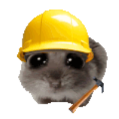

  
   
  <b>Hi there 👋</b>

  

  

**Why This Path**

I chose Science (with Computers) in school and Computer Science and Engineering in college because I love solving real-world problems with technology. I enjoy the challenge of finding efficient solutions and making an impact through innovation. Learning new topics and tools excites me, especially when they help improve my projects. Whenever I come across a new technology, I make sure to learn and apply it to solve problems more effectively.

  

         

  

## Social

 

  
 

## Stats for Nerds

  

  
<!---

  

--->
<!--
**vinayakrastogi/vinayakrastogi** is a ✨ _special_ ✨ repository because its `README.md` (this file) appears on your GitHub profile.

Here are some ideas to get you started:

- 🔭 I’m currently working on ...
- 🌱 I’m currently learning ...
- 👯 I’m looking to collaborate on ...
- 🤔 I’m looking for help with ...
- 💬 Ask me about ...
- 📫 How to reach me: ...
- 😄 Pronouns: ...
- ⚡ Fun fact: ...
-->
